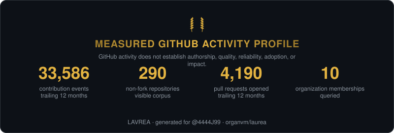
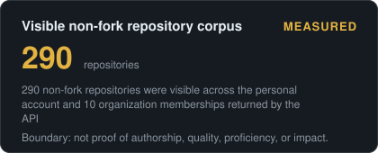
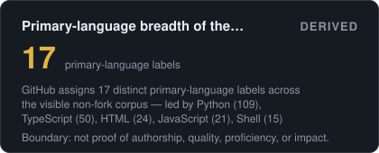
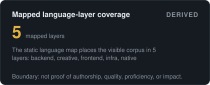

# LAVREA — measured GitHub activity with provenance

LAVREA snapshots the GitHub fields visible to a run, derives a small set of
bounded corpus descriptions, and renders the result as SVG cards. It publishes
counts and definitions, not percentile rank or engineering-quality claims.

<p align="center">
  
</p>

<p align="center">
  
  
</p>
<p align="center">
  
  
</p>

The generated report is [PROFILE.md](assets/PROFILE.md). The field definitions
and publication boundary are in [METHODOLOGY.md](METHODOLOGY.md).

## What the snapshot contains

- GitHub contribution-calendar events and their API-provided categories;
- pull requests opened in the trailing contribution collection;
- non-fork repositories visible across the personal account and returned
  organization memberships;
- GitHub-assigned primary-language labels across that visible corpus;
- the account creation date and organization memberships visible to the token.

These observations do not establish individual authorship for organization
repositories, pull-request review or merge state, code quality, reliability,
adoption, business impact, or engineering rank.

## The arena

An issue titled `arena: your-login` asks CI to compute the same bounded fields
for another public account and update [LEADERBOARD.md](LEADERBOARD.md). The table
orders rows by activity count for navigation; it is not a quality ranking.

## Run it on yourself

1. Use the repository as a template or fork it.
2. Enable Actions. The canonical `organvm/laurea` repository tracks `4444J99`;
   every other copy tracks its own repository owner.
3. Optionally add a `LAUREA_TOKEN` secret if the run should include restricted
   contribution counts and private organization visibility.
4. Embed a generated card, for example
   `https://raw.githubusercontent.com/YOU/laurea/main/assets/cards/hero.svg`.

```bash
pip install -e '.[test]'
laurea run --login YOUR_LOGIN
laurea axes
python -m pytest tests -q
```

LAVREA has zero runtime dependencies. Add an observation with one registered
function in `src/laurea/detectors.py`; every observation must name its source
field or deterministic transformation and state its interpretive boundary.

## License

MIT.
